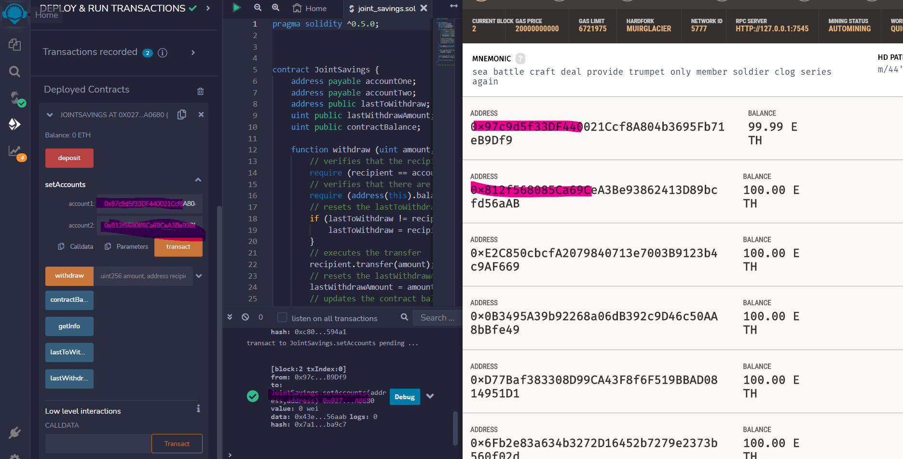
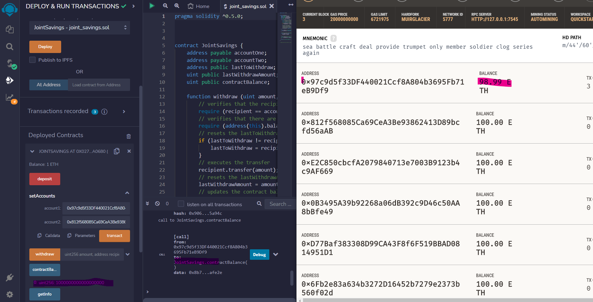
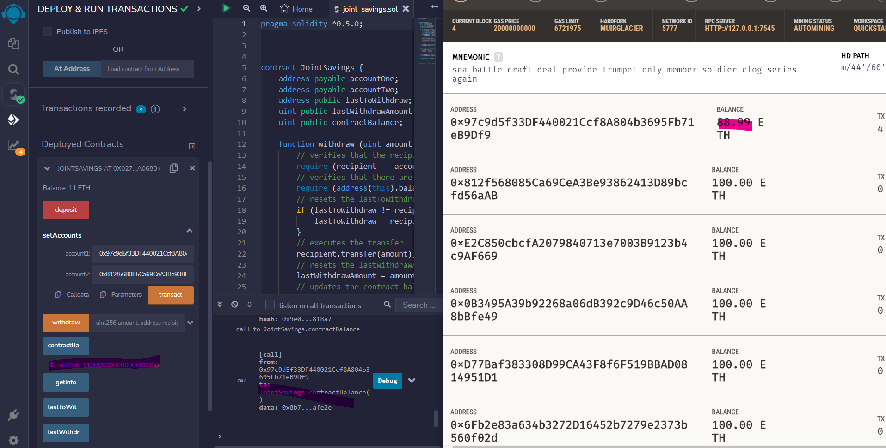
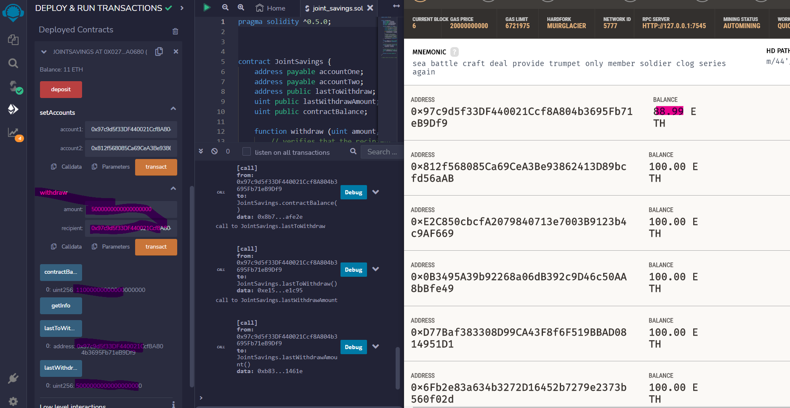
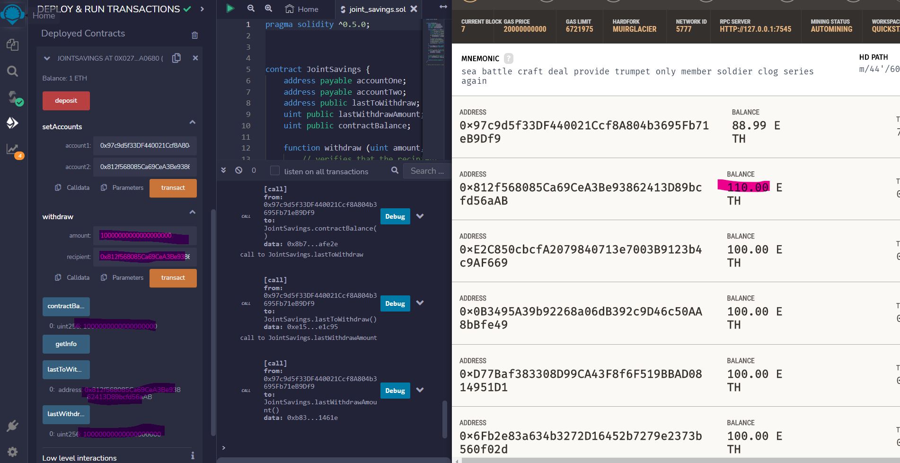

# Solidity-Challenge
The main task in this challenge was to create and deploy a smart contract that arbitrates a joint savings account written in Solidity.

### Organization
The central solidity file is `joint_savings.sol`. To run the file
1. Open in Remix
2. Copy and paste `joint_savings.sol`
3. Compile the contract
4. Deploy

### Code and Dependencies
This code is to be run on `Python 3.7.13`
Requires the download and install of Ganache

The following Python Libraries were also imported and used:

- streamlit
- dataclasses 
- typing 
- os
- requests
- dotenv 
- web3 

## Objectives
- Create a Joint Savings Account Contract in Solidity
- Compile and Deploy Your Contract in the JavaScript VM 
- Interact with Your Deployed Smart Contract

## Results and Data Story
The result was a successfully deployed smart contract.

Here is an image of the contract. On the left is the contract deployed in Remix. On the right is Ganache test net instance and the address information that will be used for the joint accounts. As you can see the first two address were used for AccountOne and AccountTwo.
[Repo Link](https://github.com/bweilers/Solidity/)  

As a next step, I tested the deposit functionality.

Here I deposited 1 Eth.
[Repo Link](https://github.com/bweilers/Solidity/)  

Here I deposited 10 Eth.
[Repo Link](https://github.com/bweilers/Solidity/)  

Here I deposited 5 Eth.
[Repo Link](https://github.com/bweilers/Solidity/)  

Lastly, I tested the withdrawl functionality. 

Here I withrdrew 5 Eth to accountOne
[Repo Link](https://github.com/bweilers/Solidity/)  

Here I withrdrew 10 Eth to accountTwo
[Repo Link](https://github.com/bweilers/Solidity/)  

